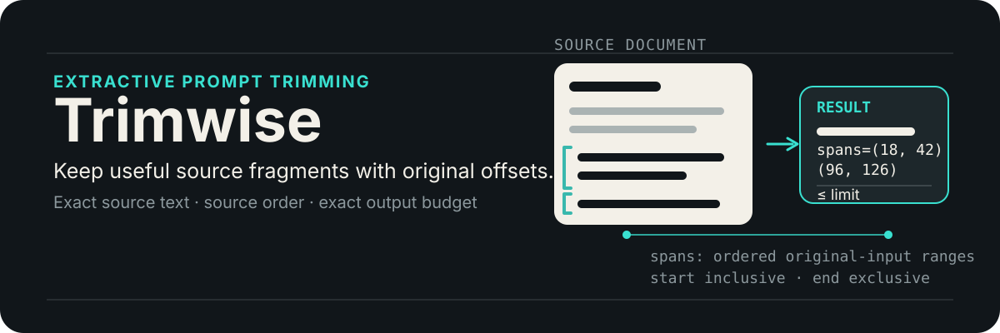
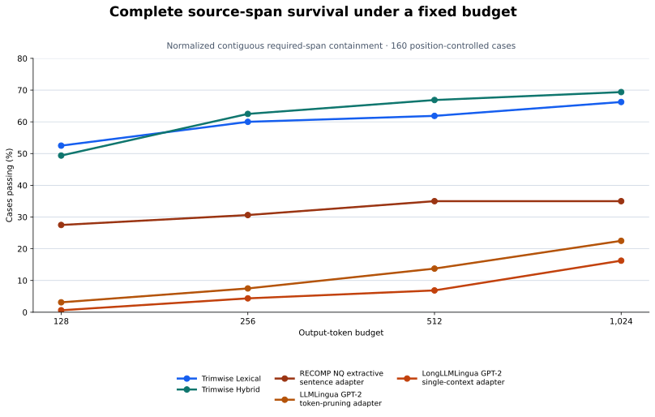

# Trimwise

[](https://pypi.org/project/trimwise/)

> Query-aware compression within an exact budget.

[Documentation](https://trimwise.readthedocs.io/en/latest/) ·
[Getting started](https://trimwise.readthedocs.io/en/latest/getting-started/) ·
[API reference](https://trimwise.readthedocs.io/en/latest/api-reference/) ·
[PyPI](https://pypi.org/project/trimwise/)

<p align="center">
  
</p>

Trimwise is built for query-aware prompt assembly. Given a question, it selects the most useful
exact source evidence from documents, blog posts, search results, logs, and tool output under an
exact token, word, or character budget. Instead of keeping only `text[:N]`, it can select complete
fragments from across the source and reduce obvious repetition.

The result remains extractive: retained text comes from your input, keeps its original wording, and
appears in source order. Trimwise does not search the web, retrieve documents, query a vector
database, or rewrite your evidence.

When no question is available, it supports queryless mode which uses bounded structural trimming for readable source
coverage.

## Getting started

### Installation

Trimwise supports Python 3.10 through 3.14.

| What you need | `pip` | `uv` |
| --- | --- | --- |
| Structural, lexical, or your own embedding callback | `python -m pip install trimwise` | `uv add trimwise` |
| Trimwise-managed semantic models on CPU | `python -m pip install "trimwise[semantic]"` | `uv add "trimwise[semantic]"` |
| Trimwise-managed semantic models on NVIDIA GPU | `python -m pip install "trimwise[semantic-gpu]"` | `uv add "trimwise[semantic-gpu]"` |

The core installation includes Markdown parsing, token measurement, lexical ranking, and vector
scoring. It does not install FastEmbed or download an embedding model.

Do not install the CPU and GPU semantic extras together. GPU use also requires compatible CUDA and
cuDNN libraries. See [Semantic Models and Async Use](https://trimwise.readthedocs.io/en/latest/semantic-and-async/)
for callbacks, model loading, concurrency, and GPU details.

### Basic usage

```python
from trimwise import Trimmer

document = """\
# Incident report

The service became unavailable at 09:14. Initial checks focused on the network.

## Root cause

The team traced the failure to an expired credential.

## Decision

Credentials will now rotate automatically every 30 days.
"""

result = Trimmer().trim(
    document,
    limit=24,
    query="What caused the outage and how will it be prevented?",
)

print(result.text)
print(result.output_count)  # Always <= 24
print(result.strategy)  # Strategy.LEXICAL: auto resolved from the query
print(result.spans)  # Original-input Python-string offsets
```

### Many sources, one shared limit

Use `trim_context()` when passages from several sources should compete for one evidence budget:

```python
result = Trimmer().trim_context(
    [record["text"] for record in records],
    limit=800,
    query="Which recommendations are supported by the reports?",
)

for source in result.sources:
    print(records[source.source_index]["url"], source.text)
```

The result keeps one row per input source, including empty excerpts, and the sum of its source
output counts stays within `limit`. Labels, URLs, caller-added headings, separators, instructions,
and answer space are outside that limit. See [Many Sources, One Shared Limit](https://trimwise.readthedocs.io/en/latest/multi-source-context/)
for the complete contract and the difference from `atrim_many()`.

Depending on the trimming strategy you want to use, find the corresponding starter code example - [auto](https://trimwise.readthedocs.io/en/latest/strategies/#auto-the-lightweight-default),
[structural](https://trimwise.readthedocs.io/en/latest/strategies/#structural-cover-a-document-without-a-query), [lexical](https://trimwise.readthedocs.io/en/latest/strategies/#lexical-preserve-exact-query-evidence),
[semantic](https://trimwise.readthedocs.io/en/latest/strategies/#semantic-preserve-meaning-and-paraphrases) and [hyrbid](https://trimwise.readthedocs.io/en/latest/strategies/#hybrid-preserve-exact-terms-and-broader-meaning).

## Available trimming strategies

| Strategy | Use it when | What it prioritizes |
| --- | --- | --- |
| `auto` | You want a safe default | `structural` without a query; `lexical` with one |
| `structural` | No question or task is available | Document centrality, section coverage, and fitting beginning/end units |
| `lexical` | Exact names, IDs, errors, URLs, or phrases matter | BM25 matches between the query and source fragments |
| `semantic` | The source may express the answer with different words or another supported language | Embedding similarity between the query and candidates |
| `hybrid` | Literal evidence and paraphrases both matter | An equal blend of normalized BM25 and semantic scores |

`lexical`, `semantic`, and `hybrid` require a nonblank query. Semantic and hybrid calls require
either your own embedding callback or one of the FastEmbed extras.

Query-aware strategies may stop below the requested limit when the remaining candidates appear
weakly related. The limit means “at most,” not “fill every token with progressively less useful
text.”

Read [Strategies](https://trimwise.readthedocs.io/en/latest/strategies/) for examples, scoring
behavior, and practical tradeoffs.

## How Trimwise compares with prompt compressors

Trimwise and model-based prompt compressors shorten text at different levels. Trimwise chooses
complete source fragments before prompt assembly. Methods such as LLMLingua can remove individual
tokens from an already assembled prompt, which can achieve much denser compression but may leave
text that is harder for people to read or trace.

| Approach | What it keeps or removes | Extra compression model | Best fit |
| --- | --- | --- | --- |
| Prefix slicing | Keeps only the beginning | No | Lowest possible overhead when missing later evidence is acceptable |
| Trimwise | Selects complete source blocks, sentences, or lines and restores source order | No for structural or lexical use | Readable, source-backed excerpts with an exact final budget |
| [LLMLingua](https://aclanthology.org/2023.emnlp-main.825/) family | Removes tokens throughout a prompt; LongLLMLingua also uses the query and long-context position | Yes | Aggressive compression when downstream model performance matters more than human-readable excerpts |
| [Selective Context](https://arxiv.org/abs/2310.06201) | Removes low-self-information tokens, phrases, or sentences | Yes | Pruning predictable language using a causal language model |
| [RECOMP](https://proceedings.iclr.cc/paper_files/paper/2024/hash/bda88ed2892f5e61c9a9bf215c566913-Abstract-Conference.html) | Selects sentences or generates a summary from retrieved documents | Yes, with trained compressors | Compressing RAG results for a downstream task, including abstractive synthesis when allowed |

The LLMLingua family can preserve more task-relevant information per token at aggressive ratios.
Its remaining tokens still come from the prompt, but complete sentence and block boundaries are not
preserved. RECOMP's extractive path keeps selected sentences; its abstractive path can combine
information across documents but no longer returns only original wording.

Choose Trimwise when evidence must stay readable, source fragments must remain verbatim and ordered,
or adding another compression model is undesirable. Choose a model-based compressor when maximum
compression density is more important and you can evaluate its effect on your own downstream task.
The methods can also be chained: select broad evidence with Trimwise, then apply token-level
compression. After the second step, Trimwise's whole-fragment and source-layout guarantees no
longer describe the final prompt.

See the detailed [research comparison](https://trimwise.readthedocs.io/en/latest/research-foundations/#how-trimwise-compares-with-model-based-compression)
for the differences among LLMLingua, LongLLMLingua, LLMLingua-2, Selective Context, and RECOMP.

## Query-aware benchmark results

On a position-controlled 160-case benchmark, each method received the same source and question.
The primary result is **normalized contiguous required-span containment**: every annotated
source span must occur as one contiguous normalized passage, prohibited text must be absent, and
the output must fit the budget. Trimwise Lexical leads at 128 tokens; Trimwise Hybrid leads from
256 through 1,024 tokens against the evaluated adapters.

<p align="center">
  
</p>

| Evaluated method or adapter | 128 | 256 | 512 | 1,024 |
| --- | ---: | ---: | ---: | ---: |
| **Trimwise Lexical** | **52.5%** | 60.0% | 61.9% | 66.2% |
| **Trimwise Hybrid** | 49.4% | **62.5%** | **66.9%** | **69.4%** |
| RECOMP NQ extractive sentence adapter | 27.5% | 30.6% | 35.0% | 35.0% |
| LLMLingua GPT-2 token-pruning adapter | 3.1% | 7.5% | 13.8% | 22.5% |
| LongLLMLingua GPT-2 single-context adapter | 0.6% | 4.4% | 6.9% | 16.2% |

| Trimwise Hybrid at 512 tokens | Observed result |
| --- | --- |
| Median warm compression at 512 tokens | **42.8 ms** |
| Median input-token reduction at 512 tokens | **84.7%** |

The local ordered 80% and 90% sensitivity checks preserve the same ordering at every budget. This
is a post-hoc robustness analysis over frozen outputs: it measures complete source-span survival,
not semantic sufficiency, generated-answer quality, or every configuration in the compared method
families. Latency is hardware-specific and excludes cold loading and thermal cooldown. The
[strict metric protocol](./benchmark/data/manifests/evidence_sensitivity_v1_2_protocol.md),
[frozen manifest](./benchmark/data/manifests/evidence_sensitivity_v1_2_manifest.json), and
[full sensitivity summary](./benchmark/results/position_controlled_160_evidence_sensitivity_v1_2_summary.csv)
record the metric, inputs, and all results. The legacy bag-of-token case-pass result remains
available as a [historical diagnostic](./benchmark/results/position_controlled_160_summary.csv).
The local benchmark environment resolves the published 0.2.0 release from PyPI.

An exploratory component study keeps Hybrid fixed while removing MMR, the adaptive evidence cutoff,
or Markdown-aware segments. On this suite, the cutoff and structural segments help at 128 tokens;
MMR shows no consistent strict-retention benefit. The full protocol, uncertainty intervals, and
limits are in the [benchmark documentation](https://trimwise.readthedocs.io/en/latest/benchmark/).

## Documentation

- [Getting Started](https://trimwise.readthedocs.io/en/latest/getting-started/)
- [Many Sources, One Shared Limit](https://trimwise.readthedocs.io/en/latest/multi-source-context/)
- [Strategies](https://trimwise.readthedocs.io/en/latest/strategies/)
- [Semantic Models and Async Use](https://trimwise.readthedocs.io/en/latest/semantic-and-async/)
- [Configuration and API](https://trimwise.readthedocs.io/en/latest/configuration-and-api/)
- [How Trimwise Works](https://trimwise.readthedocs.io/en/latest/how-it-works/)
- [Guarantees and Limitations](https://trimwise.readthedocs.io/en/latest/guarantees-and-limitations/)
- [Research Foundations](https://trimwise.readthedocs.io/en/latest/research-foundations/)
- [API Reference](https://trimwise.readthedocs.io/en/latest/api-reference/)

Trimwise is available under the [MIT License](LICENSE) and maintained by [AATBIT Labs](https://aatbit.com).
