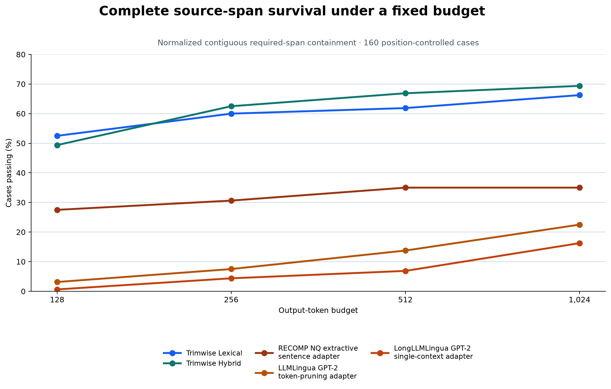
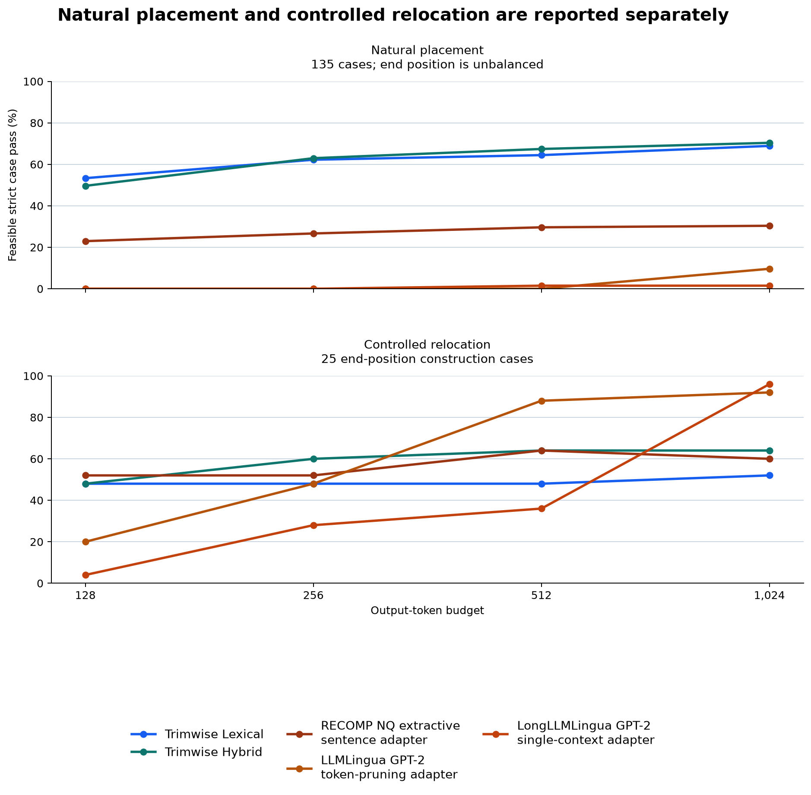

# Query-Aware Context Compression Benchmark

Trimwise is for prompt assembly when an application already has a source and a question: keep the
exact source passages most useful for that question inside a fixed output budget. This evaluation
tests that scoped task. Each method receives the same source, question, and 128-, 256-, 512-, or
1,024-token ceiling.

## Strict source-span results

The v1.2 primary result is **normalized contiguous required-span containment**. A case passes only
when every annotated source span appears as one contiguous passage after case-folding and
whitespace collapse, prohibited text is absent, and the output fits the shared token counter. It
measures complete survival of the annotated source evidence—not semantic sufficiency, answer
quality, or general prompt-compression capability.

| Evaluated method or adapter | 128 tokens | 256 tokens | 512 tokens | 1,024 tokens | Median warm trim time |
| --- | ---: | ---: | ---: | ---: | ---: |
| **Trimwise Lexical** | **52.5%** | 60.0% | 61.9% | 66.2% | 6.4 ms |
| **Trimwise Hybrid** | 49.4% | **62.5%** | **66.9%** | **69.4%** | 42.8 ms |
| RECOMP NQ extractive sentence adapter | 27.5% | 30.6% | 35.0% | 35.0% | 126.2 ms |
| LLMLingua GPT-2 token-pruning adapter | 3.1% | 7.5% | 13.8% | 22.5% | 168.0 ms |
| LongLLMLingua GPT-2 single-context adapter | 0.6% | 4.4% | 6.9% | 16.2% | 340.7 ms |

[Open the detailed strict benchmark report](benchmark-report/index.html).

Trimwise Lexical is the highest observed method at 128 tokens. Trimwise Hybrid is highest from 256
through 1,024 tokens. The two local ordered-retention sensitivity checks—80% and 90% ordered
recall inside one reference-length output window—preserve that ordering at every tested budget.

The report also separates the 135 natural-placement cases from the 25 controlled end relocations.
On the natural-only sensitivity, Hybrid passes 63.0% at 256 tokens against 26.7% for the RECOMP NQ
extractive sentence adapter; its 70.4% versus 30.4% result at 1,024 tokens has the same ordering.
That natural subset is not position-balanced because it contains only 15 natural end cases. A
separate 150-case sensitivity removes every source excerpt taken from Trimwise itself; Hybrid still
passes 63.3% at 256 tokens and 67.3% at 1,024 tokens.

### What this result means

The strict metric was specified after a review found that the original scorer could credit
bag-of-token matches scattered across an output. The v1.2 protocol was frozen before the new
aggregates were inspected and re-scores the same saved compressor outputs; it does not rerun a GPU
model or an API evaluator. It is a post-hoc robustness analysis, not a new independent experiment.

The full sensitivity CSV includes normalized contiguous containment, local ordered 80% and 90%
case pass, continuous local ordered recall, exact byte containment, and the earlier bag-of-token
metric. The older metric remains available for historical reproducibility only; it is not the
headline result on this page.

### Budget compliance and speed

Trimwise Lexical and Hybrid and the RECOMP NQ extractive sentence adapter recorded no measured
budget violations under the shared counter. The LLMLingua GPT-2 token-pruning adapter exceeded its
requested ceiling in 30.6% of query-aware calls; the LongLLMLingua GPT-2 single-context adapter did
so in 55.8%. Warm timing excludes cold model loading and thermal cooldown, and is specific to the
recorded GPU and software environment.

## Downstream answer diagnostic

The saved benchmark also asks whether a compressed context can support a short answer. This is a
separate, weaker diagnostic over 93 answerable cases with one continuation per context from
GPT-5.4 Nano, GPT-5.4 Mini, and GPT-5.6 Luna. It uses normalized answer matching; it is neither a
human correctness study nor proof that a model relied only on the context.

| Downstream evaluator | Full source | Trimwise Hybrid at 256 tokens |
| --- | ---: | ---: |
| GPT-5.4 Nano | 44.1% | 46.2% |
| GPT-5.4 Mini | 45.2% | 46.2% |
| GPT-5.6 Luna | 45.2% | 45.2% |

## Scope and limits

This is an author-annotated, position-controlled 160-case suite: 40 cases each with evidence at
the beginning, middle, end, or multiple locations. It combines 135 natural placements with 25
source-preserving end relocations. A natural-only sensitivity analysis excludes the relocations;
its end stratum has only 15 cases, so it is not position-balanced.

The comparison is against the exact adapters named above, not every configuration in the
LLMLingua, LongLLMLingua, or RECOMP families. The RECOMP NQ extractive sentence adapter is built
around the released checkpoint, not a reproduction of RECOMP's full retrieval and training pipeline.
The relocation cohort is a source-preserving construction diagnostic: moving evidence also changes
its neighboring text and the remaining source composition, so it is not interpreted as a pure causal
effect of position.
These results do not establish performance for every language, document type, private corpus,
production agent workflow, or downstream model.

## Reproduce or inspect

The frozen rows, dataset, method configuration, runtime information, source hashes, and scripts are
public. The v1.2 manifest records the exact input identities and the scorer/protocol commit; the
summary is sufficient to inspect every reported metric without making GPU or API calls.

- [Benchmark protocol and reproduction commands](https://github.com/tenwritehq/trimwise/blob/main/benchmark/README.md)
- [v1.2 metric protocol](https://github.com/tenwritehq/trimwise/blob/main/benchmark/data/manifests/evidence_sensitivity_v1_2_protocol.md)
- [v1.2 frozen input manifest](https://github.com/tenwritehq/trimwise/blob/main/benchmark/data/manifests/evidence_sensitivity_v1_2_manifest.json)
- [v1.2 complete sensitivity summary](https://github.com/tenwritehq/trimwise/blob/main/benchmark/results/position_controlled_160_evidence_sensitivity_v1_2_summary.csv)
- [v1.2 natural-only sensitivity](https://github.com/tenwritehq/trimwise/blob/main/benchmark/results/position_controlled_160_evidence_sensitivity_v1_2_natural_only_summary.csv)
- [v1.2 self-source-excluded sensitivity](https://github.com/tenwritehq/trimwise/blob/main/benchmark/results/position_controlled_160_evidence_sensitivity_v1_2_without_self_sources_summary.csv)
- [v1.2 paired bootstrap intervals](https://github.com/tenwritehq/trimwise/blob/main/benchmark/results/position_controlled_160_evidence_sensitivity_v1_2_paired_stats.csv)
- [Historical v1.1 report and source-only diagnostic](https://github.com/tenwritehq/trimwise/tree/paper-v1.1/benchmark/reports)
- [Versioned paper and PDF](https://github.com/tenwritehq/trimwise/releases/tag/paper-v1.3)

For the selection methods behind these results, see [Research Foundations](research-foundations.md).
